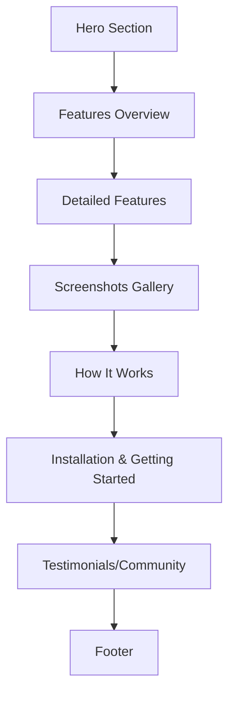

# EchoGen.ai Landing Page Implementation Plan

## Color Scheme
```color-palette
Primary: #4A5FF7
Primary Light: #6B7BFF
Primary Dark: #3347D4
Secondary: #FF6B6B
Background: #FAFBFC
Surface: #FFFFFF
Text Primary: #1A1D29
Text Secondary: #6B7280
```

## Section Structure


## Section Specifications

### 1. Hero Section
- **Elements**:
  - Animated logo reveal (fade-in + scale)
  - Tagline with typewriter effect
  - Waveform background animation
  - CTA buttons with hover animations
- **Animations**:
  - Logo: 0.5s fade-in + 0.3s scale-up
  - Tagline: Character-by-character type (70ms/char)
  - Waveform: Continuous sine wave motion

### 2. Features Overview
- **Grid Layout** (3 columns on desktop, 2 on tablet, 1 on mobile):
  ```html
  <div class="features-grid">
    <div class="feature-card">...</div>
    <!-- 6 cards total -->
  </div>
  ```
- **Card Animation**:
  - Hover: Scale(1.03) + box-shadow elevation
  - Transition: transform 0.3s ease, box-shadow 0.3s ease

### 3. Detailed Features
- **Accordion System**:
  ```javascript
  const accordions = document.querySelectorAll('.feature-accordion');
  accordions.forEach(acc => {
    acc.addEventListener('click', () => {
      // Toggle expansion
    });
  });
  ```
- **Animation**: Height transition with easing function

### 4. Screenshots Gallery
- **Carousel Implementation**:
  - Swipe functionality for mobile
  - Autoplay with 8s interval
  - Parallax effect on scroll
- **Image Optimization**:
  - WebP format with lazy loading
  - Responsive sizes: 320w, 640w, 1024w

### 5. How It Works
- **Step Visualization**:
  ```mermaid
  graph LR
    A[Input] --> B[Configure]
    B --> C[Generate Script]
    C --> D[Create Audio]
    D --> E[Manage]
  ```
- **Animations**:
  - Step connectors animate on scroll-into-view
  - Icons pulse when step becomes active

### 6. Installation & Getting Started
- **Terminal Simulation**:
  ```bash
  # Animated typing effect for commands
  git clone https://github.com/Mr-Dark-debug/EchoGen.ai.git
  cd EchoGen.ai
  flutter pub get
  ```
- **Platform Badges**: SVG icons with hover effects

### 7. Testimonials & Community
- **Live Counters**:
  ```javascript
  // GitHub stats API integration
  fetch('https://api.github.com/repos/Mr-Dark-debug/EchoGen.ai')
    .then(response => response.json())
    .then(data => {
      // Update star/fork counters
    });
  ```
- **Animation**: Number increment with easing

### 8. Footer
- **Elements**:
  - Wave divider (SVG path animation)
  - Social media links with hover effects
  - Copyright notice

## Animation Timeline
| Animation Type          | Trigger        | Duration | Easing        |
|-------------------------|----------------|----------|---------------|
| Section Reveal          | Scroll         | 600ms    | ease-out      |
| Card Hover              | Mouse Enter    | 300ms    | ease-in-out   |
| Accordion Expand        | Click          | 400ms    | cubic-bezier  |
| Button Hover            | Mouse Enter    | 200ms    | linear        |
| Counter Increment       | On Load        | 2000ms   | ease-out-quad |

## Technical Stack
- **Core**: a single self conatained html5 file nothing else

## Implementation Checklist
- [ ] Project setup (Next.js + Tailwind)
- [ ] Create layout components
- [ ] Implement animation framework
- [ ] Develop individual sections
- [ ] Add responsive behaviors
- [ ] Optimize performance (lazy loading, image optimization)
- [ ] Deploy to Vercel

## Next Steps
1. Implement the landing page in Code mode
2. Set up continuous deployment
3. Add analytics tracking