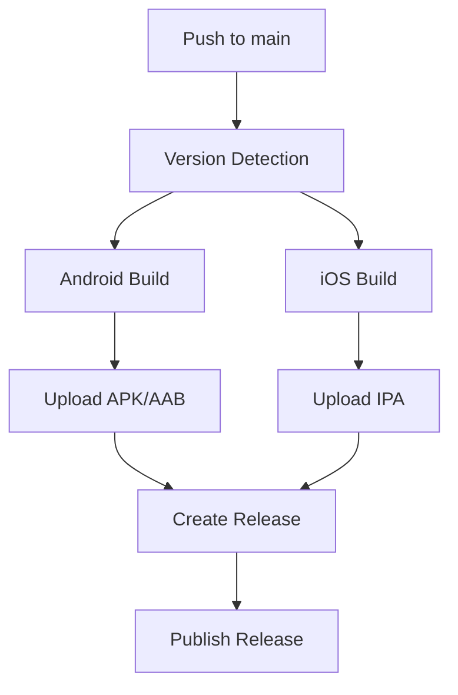

# 🚀 Complete CI/CD Setup for EchoGen.ai

This document provides a comprehensive guide to the automated CI/CD system for EchoGen.ai, including build processes, release automation, and troubleshooting.

## 📋 Overview

The CI/CD system automatically builds and releases EchoGen.ai for both Android and iOS platforms whenever changes are pushed to the main branch. It includes:

- **Automated builds** for Android APK, Android App Bundle (AAB), and iOS IPA
- **Automated releases** with proper versioning and release notes
- **Quality assurance** through automated testing and code analysis
- **Cross-platform support** with optimized build environments

## 🔧 System Requirements

### Flutter & Dart Versions
- **Flutter**: 3.32.2+ (automatically upgraded to latest stable)
- **Dart**: 3.5.0+ (comes with Flutter)
- **Java**: 17 (for Android builds)
- **Xcode**: Latest stable (for iOS builds on macOS)

### GitHub Actions Requirements
- Repository with GitHub Actions enabled
- Proper permissions for creating releases
- Access to GitHub-hosted runners (Ubuntu, macOS)

## 🏗️ Workflow Architecture

### 1. Main Release Workflow (`.github/workflows/release.yml`)
**Triggers**: Push to `main` branch or new tags
**Runners**: Ubuntu (Android), macOS (iOS)

#### Jobs:
1. **Version Detection**: Extracts version from `pubspec.yaml`
2. **Android Build**: Builds APK and AAB files
3. **iOS Build**: Builds IPA file (unsigned)
4. **Release Creation**: Creates GitHub release with artifacts

#### Build Process:


### 2. Development Build Workflow (`.github/workflows/build.yml`)
**Triggers**: Pull requests to main/develop
**Purpose**: Testing and validation without release

### 3. Test Build Workflow (`.github/workflows/test-build.yml`)
**Triggers**: Manual dispatch
**Purpose**: Test build system before pushing to main

### 4. Android-Only Workflow (`.github/workflows/android-only.yml`)
**Triggers**: Manual dispatch, push to develop/test branches
**Purpose**: Quick Android-only builds for testing

## 🔄 Build Process Details

### Android Build Steps
1. **Environment Setup**
   - Ubuntu runner with Java 17
   - Flutter 3.32.2+ installation
   - Flutter upgrade to latest stable

2. **Code Preparation**
   - Clean Flutter project
   - Get dependencies with `flutter pub get`
   - Update version in `pubspec.yaml`

3. **Quality Checks**
   - Code analysis with `flutter analyze`
   - Test execution (optional, continues on failure)

4. **Build Execution**
   - APK build: `flutter build apk --release --verbose`
   - AAB build: `flutter build appbundle --release --verbose`

5. **Artifact Management**
   - Upload to GitHub Actions artifacts
   - Rename with version numbers for release

### iOS Build Steps
1. **Environment Setup**
   - macOS runner with Xcode
   - Flutter 3.32.2+ installation
   - Flutter upgrade to latest stable

2. **Code Preparation**
   - Clean Flutter project
   - Get dependencies
   - Update version in `pubspec.yaml`

3. **Build Execution**
   - iOS build: `flutter build ios --release --no-codesign --verbose`
   - IPA creation: Manual packaging of Runner.app

4. **Artifact Management**
   - Create IPA archive
   - Upload for release

## 📦 Release Artifacts

Each release automatically generates:

### Android
- **APK File**: `EchoGenAI-Android-v{version}.apk`
  - Direct installation on Android devices
  - Requires "Unknown sources" enabled
  
- **App Bundle**: `EchoGenAI-Android-v{version}.aab`
  - Google Play Store distribution format
  - Optimized for Play Store upload

### iOS
- **IPA File**: `EchoGenAI-iOS-v{version}.ipa`
  - iOS installation package (unsigned)
  - Requires sideloading tools (AltStore, Sideloadly)

## 🎯 Version Management

### Automatic Version Detection
- Reads version from `pubspec.yaml`
- Format: `MAJOR.MINOR.PATCH+BUILD`
- Build number auto-incremented based on git commits

### Version Bump Options
1. **Automatic**: Use GitHub Actions "Version Bump" workflow
2. **Script-based**: Use `scripts/bump_version.sh` or `scripts/bump_version.bat`
3. **Manual**: Edit `pubspec.yaml` directly

### Semantic Versioning
- **Major** (1.0.0 → 2.0.0): Breaking changes
- **Minor** (1.0.0 → 1.1.0): New features, backwards compatible
- **Patch** (1.0.0 → 1.0.1): Bug fixes, small improvements

## 🧪 Testing & Validation

### Local Testing
Before pushing to CI/CD, test locally:

```bash
# Linux/macOS
./scripts/test_build.sh

# Windows
scripts\test_build.bat
```

### CI/CD Testing
Use the test workflow to validate builds:
1. Go to GitHub Actions
2. Run "Test Build System" workflow
3. Choose platforms to test
4. Review results before pushing to main

### Quality Gates
- Code analysis must pass
- Dependencies must resolve correctly
- Builds must complete successfully
- Artifacts must be created and properly sized

## 🚀 Deployment Process

### Automatic Deployment
1. **Push to main**: `git push origin main`
2. **Automatic trigger**: GitHub Actions starts build
3. **Build execution**: Parallel Android and iOS builds
4. **Release creation**: Automatic GitHub release with artifacts
5. **Notification**: Release published with download links

### Manual Deployment
1. **Version bump**: Use scripts or GitHub Actions
2. **Tag creation**: `git tag v1.2.3`
3. **Push tags**: `git push origin main --tags`
4. **Automatic build**: Triggered by tag creation

## 🔍 Monitoring & Debugging

### Build Status
- Check GitHub Actions tab for build status
- View detailed logs for each step
- Monitor artifact creation and upload

### Common Issues & Solutions

#### Build Failures
1. **Dependency conflicts**: Update `pubspec.yaml` constraints
2. **Flutter version mismatch**: Ensure 3.32.2+ compatibility
3. **Missing permissions**: Check repository settings

#### Release Issues
1. **Artifact not found**: Check build logs for upload errors
2. **Version conflicts**: Ensure unique version numbers
3. **Permission denied**: Verify GitHub token permissions

### Debug Commands
```bash
# Check Flutter installation
flutter doctor -v

# Validate dependencies
flutter pub get
flutter pub deps

# Test build locally
flutter build apk --release --verbose
flutter build ios --release --no-codesign --verbose
```

## 📊 Performance Optimization

### Build Speed
- Parallel Android and iOS builds
- Cached dependencies where possible
- Optimized runner selection

### Artifact Size
- Release builds with optimizations enabled
- Proper tree-shaking and minification
- Compressed IPA creation

### Resource Usage
- Efficient runner utilization
- Cleanup after builds
- Artifact retention policies

## 🔒 Security Considerations

### Code Signing
- Android: Uses debug signing for open-source distribution
- iOS: Unsigned builds for sideloading
- Production: Implement proper signing for store distribution

### Secrets Management
- No hardcoded API keys in CI/CD
- Use GitHub Secrets for sensitive data
- Secure artifact storage

### Access Control
- Protected main branch
- Required reviews for critical changes
- Audit logs for all deployments

## 📈 Metrics & Analytics

### Build Metrics
- Build success rate
- Build duration trends
- Artifact size tracking
- Download statistics

### Release Metrics
- Release frequency
- Version adoption
- User feedback correlation

## 🛠️ Maintenance

### Regular Tasks
- Update Flutter version in workflows
- Review and update dependencies
- Monitor build performance
- Clean up old artifacts

### Quarterly Reviews
- Evaluate build efficiency
- Update documentation
- Review security practices
- Plan infrastructure improvements

## 📞 Support & Troubleshooting

### Getting Help
1. Check this documentation
2. Review GitHub Actions logs
3. Search existing issues
4. Create new issue with build logs

### Emergency Procedures
- Disable automatic builds if needed
- Manual release creation process
- Rollback procedures for failed releases

---

**Remember**: This CI/CD system is designed for reliability and ease of use. Every push to main creates a production-ready release!
